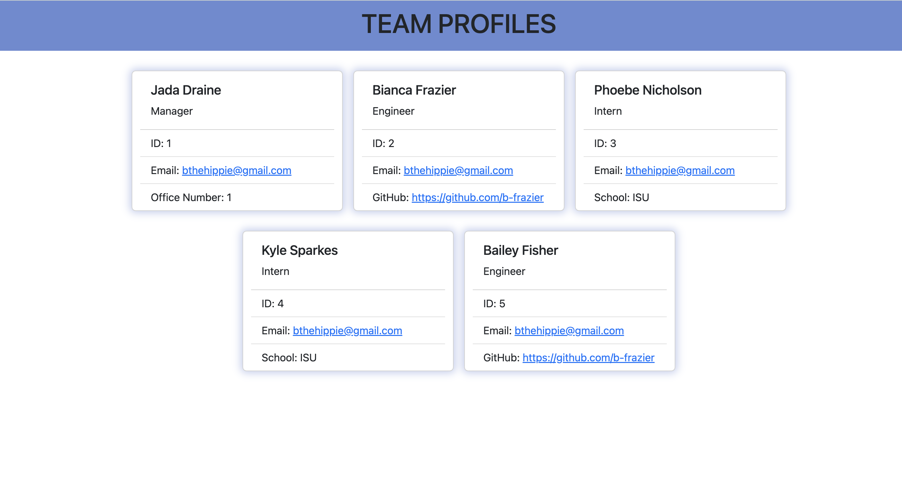

# Team Profile Generator

  ## Description
  A command line application that takes in information about a team (in this case, a fictional engineering team) and outputs it to an HTML page. The webpage will summarize each person, their role and contact information.

  ## Table of Contents
  - [Installation](#installation)
  - [Demonstration](#Demonstration)
  - [Usage](#usage)
  - [License](#license)
  - [Contributing](#contributing)
  - [Tests](#tests)
  - [Questions](#questions)

  ## Installation

  ## Demonstration
  ### Video
  https://drive.google.com/file/d/1gOoRDSojn1Li1uk8oytzRnE8yfBg1StQ/view

  ### Screenshot
  

  ## Usage
  This project should be used to quickly takedown information on team members or employees for easy access.

  ## License
  None  
  

  ## Contributing
  N/a

  ## Tests
  There are unit testing files for this purpose.

  ## Questions
  Contact information for any questions: 
  bianca.frazier90@gmail.com 
  https://github.com/b-frazier/
